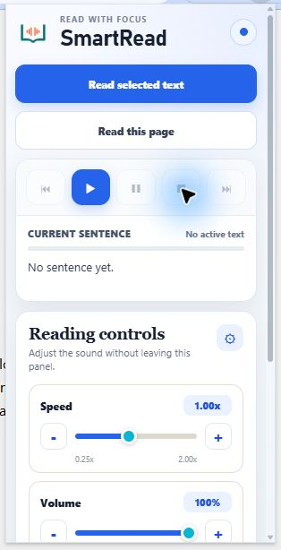
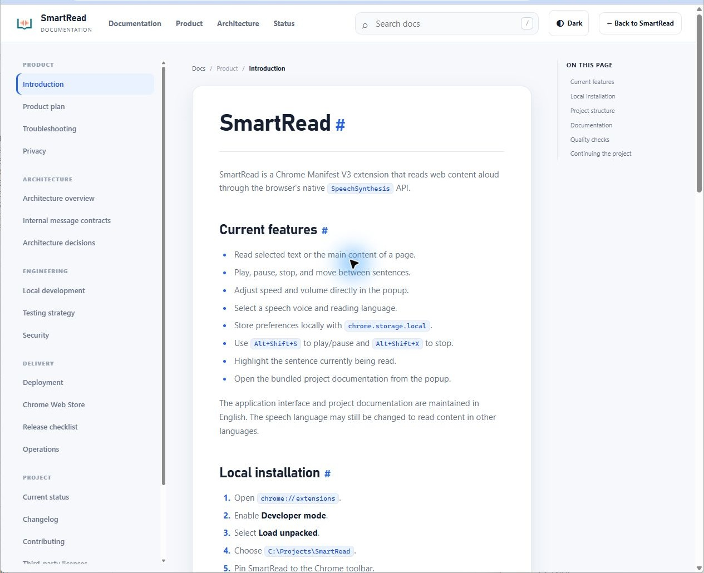

# SmartRead

Read selected text or complete web pages aloud without leaving the browser.

**Chrome Manifest V3 · Local-first · No accounts · No analytics**

SmartRead uses the browser's native `SpeechSynthesis` API. Page text and preferences
stay in the local Chrome profile; the extension has no application server or cloud API.

## Current features

- Read selected text or the main content of a page.
- Play, pause, stop, and move between sentences.
- Adjust speed and volume directly in the popup.
- Select a speech voice and reading language.
- Store preferences locally with `chrome.storage.local`.
- Use `Alt+Shift+S` to play/pause and `Alt+Shift+X` to stop.
- Highlight the sentence currently being read.
- Open the bundled project documentation from the popup.

The application interface and project documentation are maintained in English. The
speech language may still be changed to read content in other languages.

## Product preview

The following images were captured from SmartRead `0.4.1` running as an unpacked
extension in Google Chrome.



### Bundled documentation



## Local installation

1. Open `chrome://extensions`.
2. Enable **Developer mode**.
3. Select **Load unpacked**.
4. Choose `C:\Projects\SmartRead`.
5. Pin SmartRead to the Chrome toolbar.

After changing files, select **Reload** on the extension card and refresh the web page
where SmartRead will run.

After the first manual installation, open the Chrome extension management page with:

```powershell
npm run dev
```

Chrome intentionally requires unpacked extensions to be loaded and reloaded from its
extension management page. The command opens that page in the installed Chrome profile.

## Project structure

- `background/`: service worker, commands, context menus, and state coordination.
- `content-script/`: text extraction, sentence segmentation, highlighting, and speech.
- `popup/`: primary user interface and settings.
- `icons/`: extension icons used by Chrome.
- `docs/`: architecture, testing, security, deployment, and operations.
- `scripts/`: safe release packaging.
- `test/`: tests organized by level.
- `.github/`: continuous integration and contribution templates.
- `docs/AGENTS.md`: mandatory instructions for future Codex sessions.
- `docs/CURRENT_STATUS.md`: operational status and next actions.

## Documentation

- [Architecture](docs/ARCHITECTURE.md)
- [Internal message contracts](docs/API.md)
- [Local development](docs/DEVELOPMENT.md)
- [Testing strategy](docs/TESTING.md)
- [Mandatory release checklist](docs/RELEASE_CHECKLIST.md)
- [Deployment](docs/DEPLOYMENT.md)
- [Operations](docs/OPERATIONS.md)
- [Security](docs/SECURITY.md)
- [Privacy](docs/PRIVACY.md)
- [Troubleshooting](docs/TROUBLESHOOTING.md)
- [Chrome Web Store submission](docs/STORE_SUBMISSION.md)

## Privacy and security

- No accounts, backend server, analytics, advertisements, or data sales.
- No runtime dependencies or remote executable code.
- Page text is processed locally and retained only for the active reading session.
- Preferences are stored in `chrome.storage.local`; tab state uses `chrome.storage.session`.
- Permissions are limited to `activeTab`, `contextMenus`, `storage`, and `scripting`.
- Secrets and private-key file formats are excluded by `.gitignore`.

Read the complete [security policy](docs/SECURITY.md) and
[privacy policy](docs/PRIVACY.md).

## Quality checks

```powershell
npm test
```

Automated checks do not replace testing the unpacked extension in Chrome.

To create a distribution ZIP from an explicit allowlist:

```powershell
npm run package
```

Every release must complete [RELEASE_CHECKLIST.md](docs/RELEASE_CHECKLIST.md). A
failed critical or high-risk check blocks deployment. Any `N/A` result requires a
documented justification.

## Continuing the project

1. Read `docs/AGENTS.md`.
2. Review `docs/CURRENT_STATUS.md`.
3. Continue from the documented next actions.

SmartRead is developed in short, verifiable phases.

## Repository

Project home: [github.com/dafermen/SmartRead](https://github.com/dafermen/SmartRead)

## DOC-STD-20261002 — Documentation entry point

Use the [documentation map](docs/README.md) to find the authoritative guide for trying, developing or maintaining SmartRead. The public [installation site](https://smartread.innovalogic.tech/) provides instructions and documentation; the extension still needs to be installed in Chrome.
